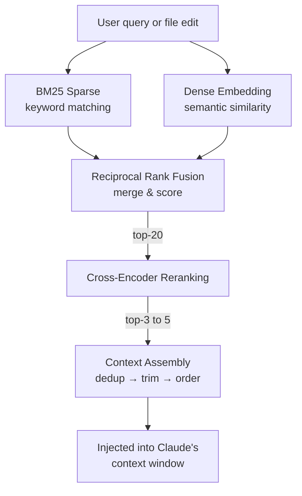

# rag-research

> A drop-in RAG system for [Claude Code](https://docs.anthropic.com/en/docs/claude-code) that gives your AI assistant persistent, searchable knowledge of your entire codebase.

**One command to install. Five questions to configure. Zero infrastructure.**

## What it does

| Feature | Detail |
|---------|--------|
| **Hybrid retrieval** | BM25 keyword search + dense embeddings fused with Reciprocal Rank Fusion |
| **Cross-encoder reranking** | `ms-marco-MiniLM-L-6-v2` re-scores top candidates for precision |
| **Semantic chunking** | Splits code on function boundaries (AST-aware) and docs on headings |
| **Context budget enforcement** | Never exceeds your configured token limit — chunks are trimmed to fit |
| **Automatic staleness detection** | Tracks file changes and reindexes only what's needed |
| **Session memory** | Persists project context, session state, and architectural decisions across sessions |
| **Claude Code integration** | Hooks, slash commands, and a skill file — all pre-wired |

## Quickstart

```bash
# 1. Clone into your project (or copy the files)
git clone https://github.com/ptubridyreimagined/rag-research.git
cd rag-research

# 2. Install everything
bash rag-init.sh

# 3. Verify
python rag/engine.py --query "main entry point"
```

The installer will:
- Detect your project type (Python, Node, Go, Rust, or generic)
- Install Python dependencies (`sentence-transformers`, `chromadb`, `rank-bm25`)
- Walk you through 5 configuration questions
- Build the initial search index
- Register Claude Code hooks

## How it works



## Slash commands

Use these mid-session in Claude Code:

| Command | What it does |
|---------|-------------|
| `/rag-search <query>` | Search the index and display top chunks with scores |
| `/rag-reindex` | Reindex all stale files and report changes |
| `/rag-status` | Show index stats — file count, chunks, staleness % |
| `/rag-context` | Show exactly what context would be injected right now |
| `/rag-forget <path>` | Remove a file or directory from the index |
| `/rag-decision "..."` | Log a timestamped architectural decision |

## Hooks

Registered automatically in `.claude/settings.json`:

| Hook | Trigger | Behavior |
|------|---------|----------|
| `post-session-start.sh` | Session begins | Loads `PROJECT.md`, `SESSION.md`, retrieves context for last task |
| `pre-tool-use.py` | Before file read/edit | Retrieves related chunks for the target file |
| `post-tool-use.py` | After file write | Marks edited files as stale for reindexing |
| `post-session-end.sh` | Session ends | Updates `SESSION.md`, reindexes stale files |
| `reindex-watch.sh` | Manual / file watcher | Incrementally reindexes changed files |

## Project structure

```
.
├── rag-init.sh                 # One-command installer
├── rag-setup.py                # Interactive 5-question wizard
├── RAG-SYSTEM.md               # Detailed documentation
├── rag/
│   ├── engine.py               # Core: index, retrieve, assemble, CLI
│   ├── chunker.py              # Semantic / fixed / hybrid chunking
│   └── config.py               # Config loader
├── .rag/
│   ├── config.yaml             # Configuration (tracked)
│   ├── index/                  # ChromaDB store (gitignored)
│   ├── chunks/                 # Chunk cache (gitignored)
│   ├── context/
│   │   ├── PROJECT.md          # Auto-generated project summary
│   │   ├── SESSION.md          # Session state
│   │   └── DECISIONS.md        # Architectural decisions log
│   ├── prompts/
│   │   ├── retrieval.md        # Injected with RAG results
│   │   └── session-start.md    # Session loading instructions
│   └── logs/                   # Retrieval logs (gitignored)
├── .claude/
│   ├── settings.json           # Hook registrations
│   ├── hooks/                  # 5 hook scripts
│   ├── commands/               # 6 slash commands
│   └── skills/
│       └── RAG.md              # Teaches Claude how to use the system
└── .github/workflows/
    └── rag-reindex.yml         # CI: reindex on push to main
```

## Configuration

All settings live in `.rag/config.yaml`. Key options:

| Setting | Default | Description |
|---------|---------|-------------|
| `chunk_strategy` | `semantic` | `semantic`, `fixed`, or `hybrid` |
| `chunk_size_tokens` | `400` | Target tokens per chunk |
| `embedding_model` | `all-MiniLM-L6-v2` | Any sentence-transformers model |
| `context_budget_tokens` | `40000` | Max tokens for retrieved context |
| `retrieval_top_k` | `20` | Candidates from initial retrieval |
| `inject_top_k` | `3` | Chunks injected into context |
| `min_similarity` | `0.25` | Score threshold to include results |
| `reranking_enabled` | `true` | Toggle cross-encoder reranking |

Re-run `python rag-setup.py` to reconfigure without losing the index.

See [`RAG-SYSTEM.md`](RAG-SYSTEM.md) for the full config reference, troubleshooting, and extension guide.

## Requirements

- **Python 3.10+**
- **No GPU required** — all models run on CPU
- Works offline after initial dependency install (~80MB for embedding model)

## Research

This system is based on a comprehensive research report included in the repo:

[`rag-context-optimization-report.md`](rag-context-optimization-report.md) — covers chunking strategies, embedding/retrieval approaches, context assembly, index architecture, multi-session state management, and failure modes, with comparison tables, decision trees, and a recommended baseline stack.

## License

MIT
